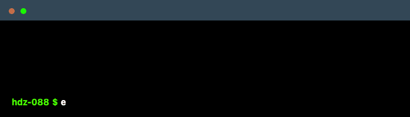

  </img> 
  </img>
  
  
  
  
  
  

# 💫 About Me:

As a diligent student enrolled in the Bachelor of Computer Applications (BCA) program at Silver Oak University, I am proud to have attained a commendable CGPI of 9.27 during my first semester. Currently advancing through my second semester, I am deeply passionate about the field of Data Science. Additionally, I possess proficiency in web development, Java programming, as well as Git & GitHub. I am eager to further develop my skills and contribute meaningfully to the exciting realms of technology and data science.

## 🌐 Socials:
  

# 💻 Tech Stack:
           
# 📊 GitHub Stats:
 
 

## 🏆 GitHub Trophies

### ✍️ Random Dev Quote

---

